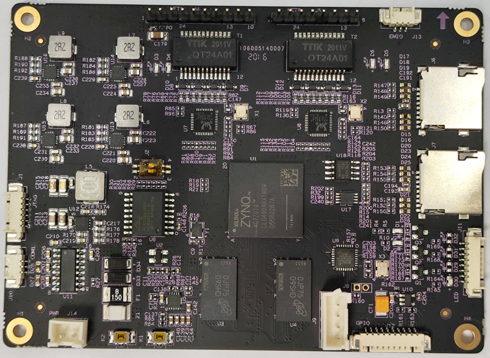
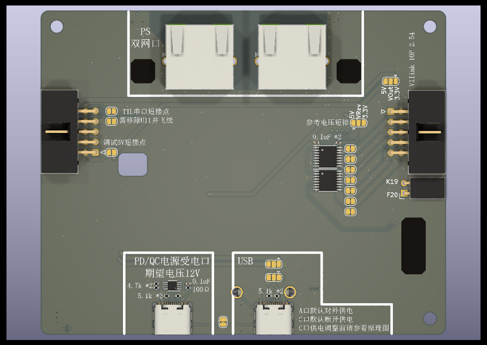

# ZYNQ7调试器开发平台
## 硬件分析
### 主板

* [主板接口定义](./board_ZYNQ7_MB_V01/interface.md)
### 扩展板

### 测试
* [01_pl_io_k2_led](./board_zynq7ext/test/01_pl_io_k2_led/01_pl_io_k2_led.xpr) ：K2按键控制三个LED
* [02_pl_io_k2_all_io](./board_zynq7ext/test/02_pl_io_k2_all_io/02_pl_io_k2_all_io.xpr) ：K2按键控制所有引出的PL_IO依次进行电平反转
* [03_ddr3_uart](./board_zynq7ext/test/03_ddr3_uart/03_ddr3_uart.xpr) ：测试DDR3及UART
* [04_ps_net](./board_zynq7ext/test/04_ps_net/04_ps_net.xpr) ：测试ps端双网口
* [05_ps_sdio](./board_zynq7ext/test/05_ps_sdio/05_ps_sdio.xpr) ：测试ps端sdio
* [06_pl_sdio](./board_zynq7ext/test/06_pl_sdio/06_pl_sdio.xpr) ：测试pl端sdio

## `施工中，待续。。。`
